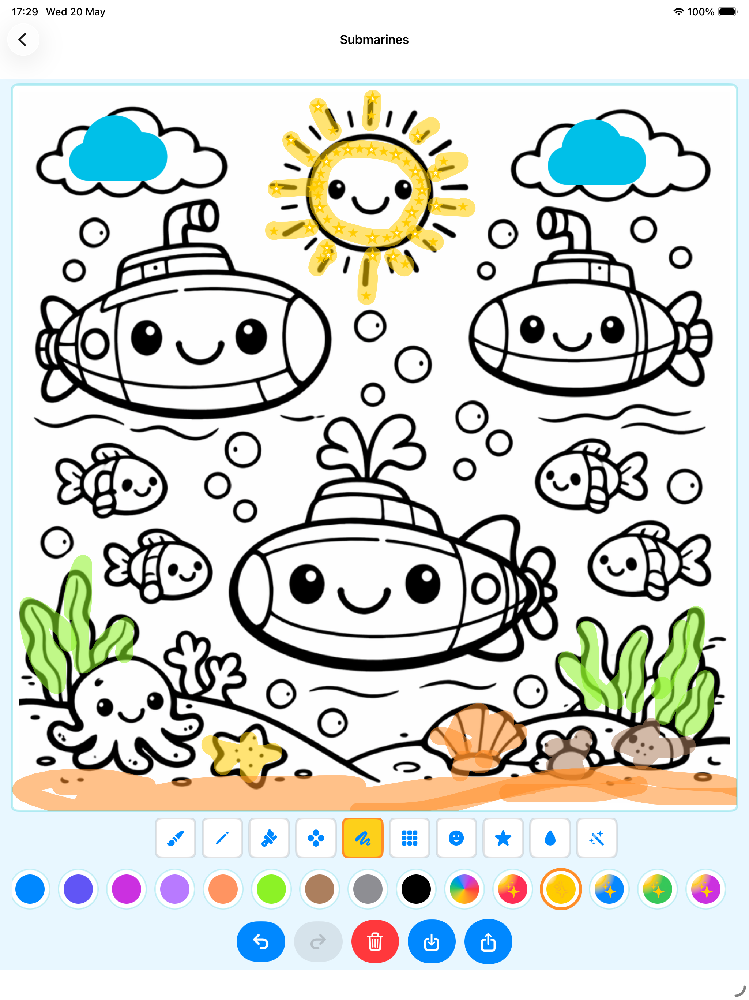
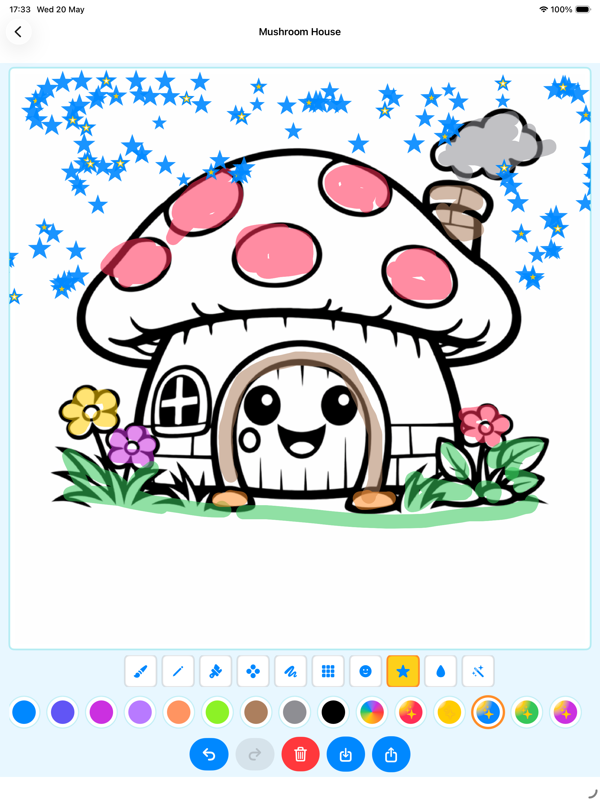
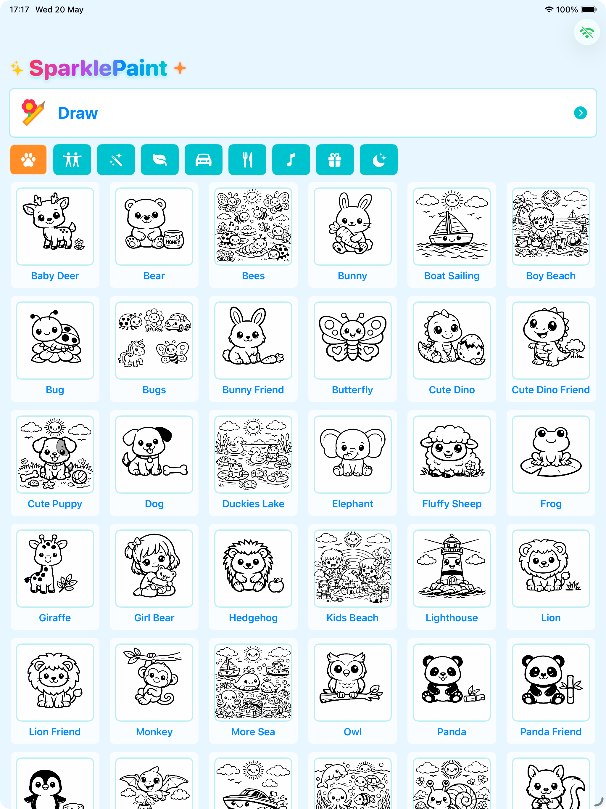

# SparklePaint
Coloring book for kids

##  Welcome to the happiest coloring book app for little artists!
Our cute world is full of smiling animals, cars, dinosaurs, and magical friends waiting for your child’s colors.

* More than 270 coloring pages! More will be added soon!
* Translated in 37 languages!

Why parents love it:
- Works without internet - perfect for travel or quiet playtime.
- No ads, no data collection, just creativity and smiles.
- Simple controls made for small fingers.
- Undo button for easy fixes.

Why kids love it:
- Over 270 coloring pages across 11 themes (Animals, Dinosaurs, Cars, Food, Ocean, Christmas and more)!!!
- 8 fun brushes: crayon, pencil, paintbrush, chalk, sponge, stickers, stars, magic wand with sparkles!
- Unlimited colors and stickers to decorate every picture.
- Cute magic colorful effects and sparkling crayons and brushes, that make painting feel alive.

Play anywhere:
- No Wi‑Fi? No problem! Everything works offline so kids can color on a plane, in a car, or at grandma’s house.

Made with love:
- Designed by parents to help toddlers (ages 2–5) develop creativity, focus, and fine motor skills in a safe environment.

Download now and turn every moment into a colorful adventure!

---

---

---

---
